# LAB 1

# Difference Between CMD and ENTRYPOINT

CMD is used to provide a default command for the container.  
This command can be overridden when running the container.

ENTRYPOINT is used to define the main executable of the container.  
It always runs when the container starts and is not easily overridden.

Example:

```dockerfile
CMD ["python", "app.py"]
```

If the container is started with another command, the CMD instruction will be replaced.

---

# Difference Between COPY and ADD

COPY is used to copy files and directories from the host machine into the Docker image.

ADD can do the same thing as COPY, but it also supports extracting compressed files automatically and downloading files from URLs.

For regular file copying, COPY is the recommended instruction because it is simpler and more predictable.

---

# Problem 1

- Run the container hello-world
- Check the container status
- Start the stopped container
- Remove the container
- Remove the image

## Run the container hello-world

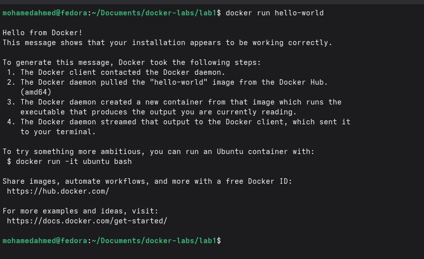

## Check the container status

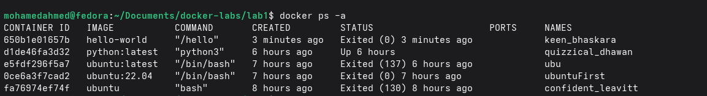

## Start the stopped container

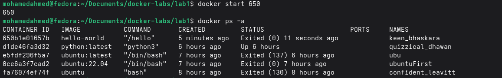

## Remove the container

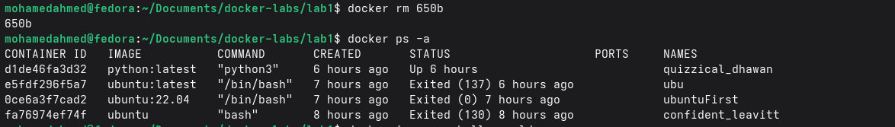

## Remove the image

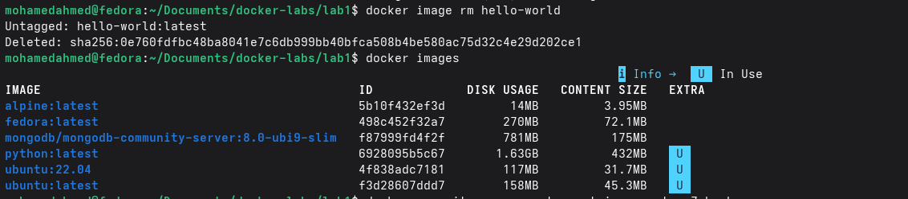

---

# Problem 2

- Run container centos or ubuntu in an interactive mode
- Run the following command in the container “echo docker ”
- Open a bash shell in the container and touch a file named hello-docker
- Stop the container and remove it. Write your comment about the file hello-docker
- Remove all stopped containers

## Run container centos or ubuntu in an interactive mode

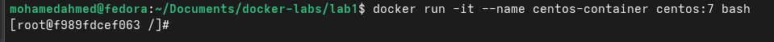

## Run the following command in the container “echo docker ”

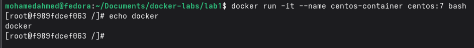

## Open a bash shell in the container and touch a file named hello-docker

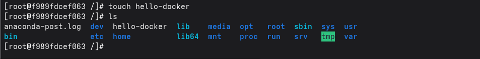

## Stop the container and remove it. Write your comment about the file hello-docker

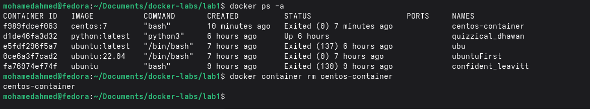
`The file hello-docker was created inside the container filesystem. After removing the container, the file was deleted because it was stored in the container writable layer and not in a Docker volume.`

## Remove all stopped containers

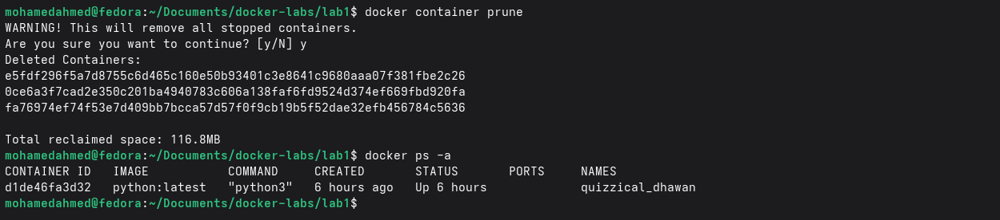

---

# Problem 3

- Deploy a MySQL database called app-database. Use the mysql latest image, and use the
  -e flag to set MYSQL_ROOT_PASSWORD to P4sSw0rd0!. The container should run in the
  background.

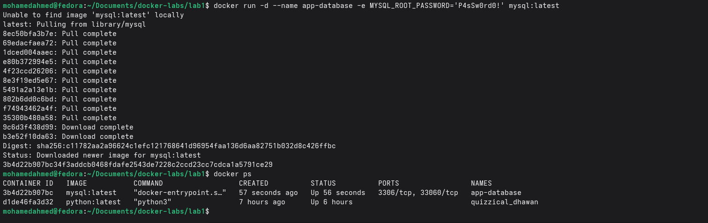

---

# Problem 4

- Run the image Nginx
- Add html static files to the container and make sure they are accessible
- Commit the container with image name IMAGE_NAME

## Run the image Nginx

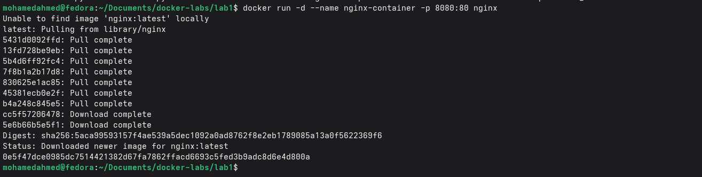

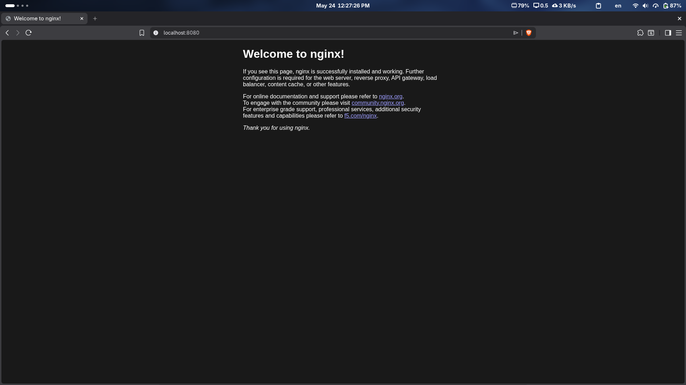

## Add html static files to the container and make sure they are accessible

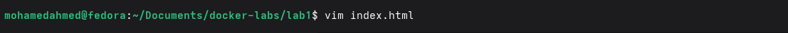

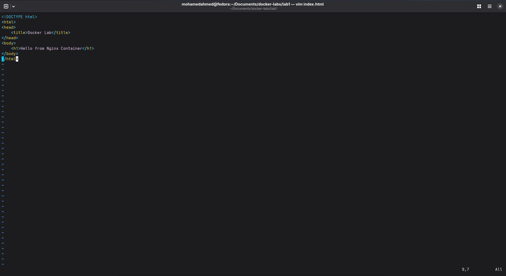

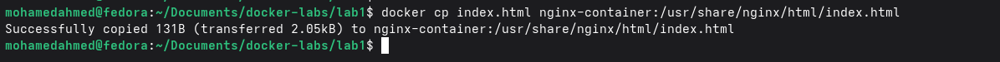

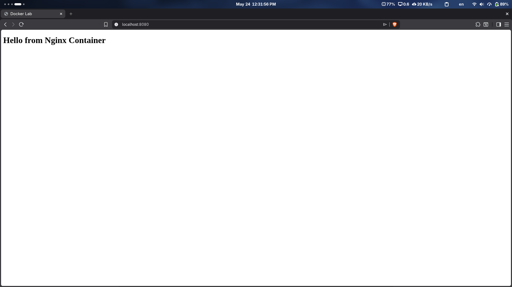

## Commit the container with image name IMAGE_NAME

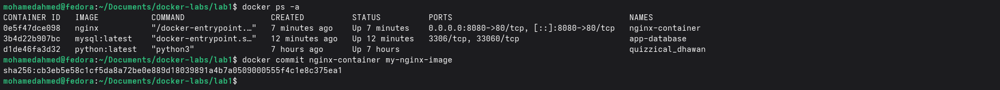

---

# Problem 5

- Create a python simple app
- Create a dockerfile to containerize the python app
- Build the image and test it
- (Bonus)create a dockerfile for the same app in smaller size using multi staging
- Push the created image into your docker hub repo

## Create a python simple app

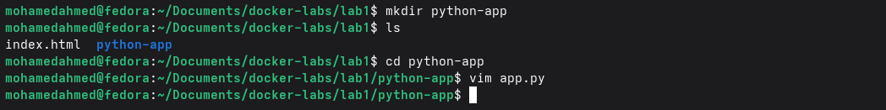
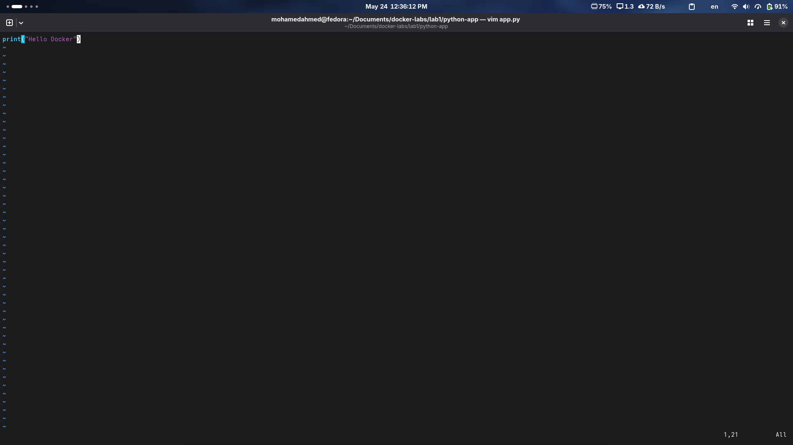
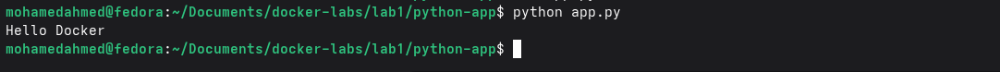

## Create a dockerfile to containerize the python app

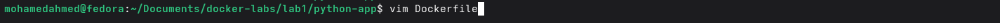
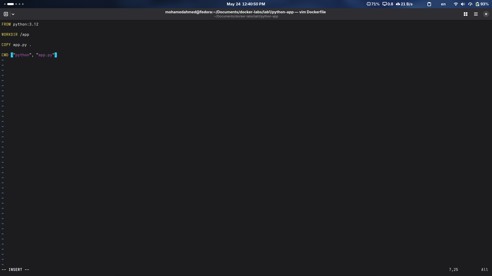

## Build the image and test it

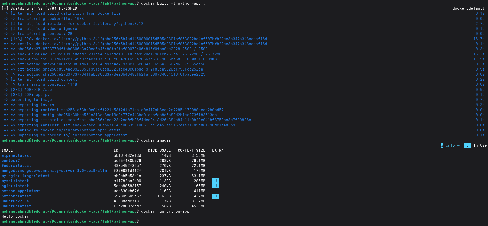

---

## (Bonus)create a dockerfile for the same app in smaller size using multi staging


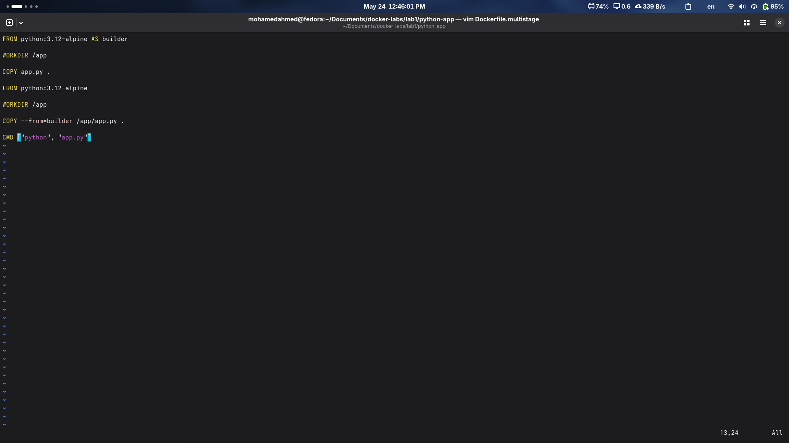
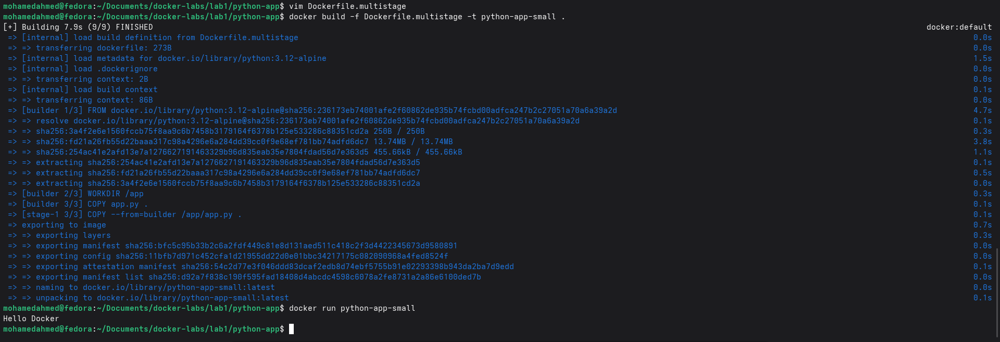

---

## Push the created image into your docker hub repo

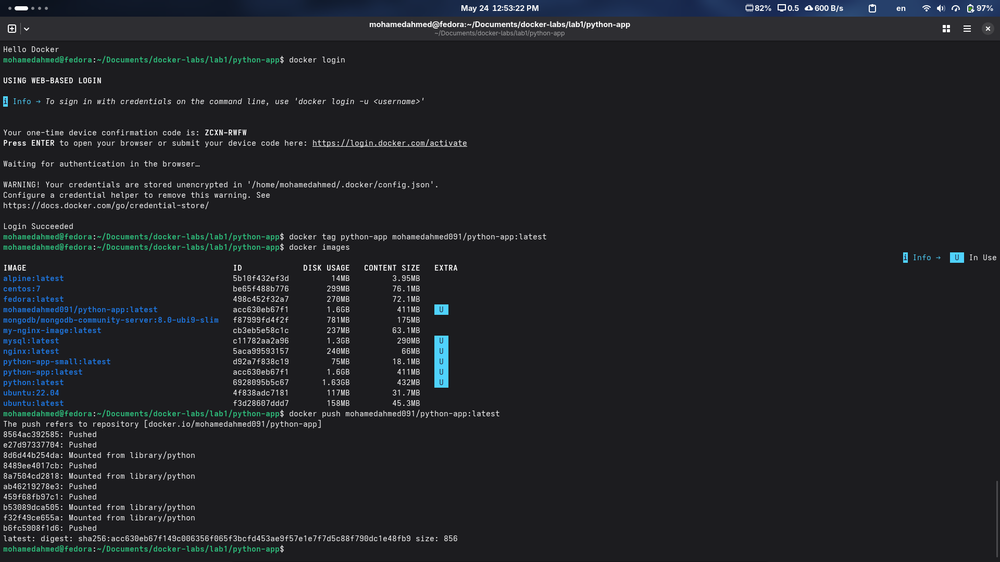
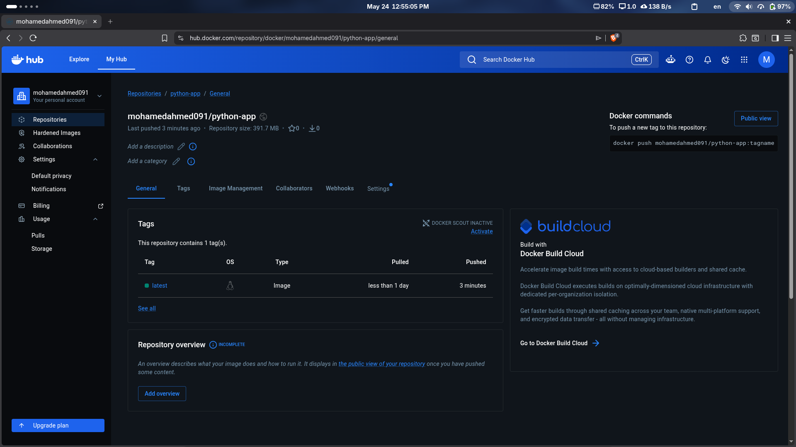
